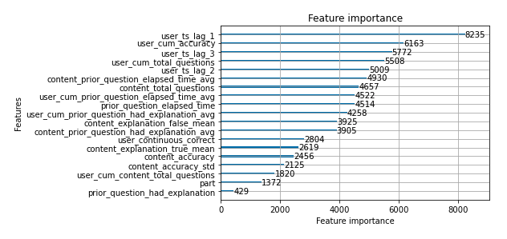

# Riiid! Answer Correctness Prediction
This repo contains my solution for Kaggle competition [Riiid AIEd Challenge 2020](https://www.kaggle.com/c/riiid-test-answer-prediction).

## Project Summary

**Intent**  
In this competition, the challenge is to create algorithms for "Knowledge Tracing", the modeling of student knowledge over time. The goal is to accurately predict how students will perform on future interactions. Riiid’s EdNet data is provided (the world’s largest open database for AI education containing more than 100 million student interactions).

**Result**  
My final solution is based on ensemble of LGBM and SAKT, which gives 0.786 on private leaderboard, 0.784 on public leaderboard, and lands  top 13% (436th place out of 3395 teams) in the competition.

**Scripts**  

| File Name | Notes |  
| --- | --- |  
| [riiid-eda.ipynb](https://github.com/budingtanke/riiid-answer-correctness-prediction/blob/master/riiid-eda.ipynb) | Exploratory data analysis. |
| [riiid-lgbm-train.ipynb](https://github.com/budingtanke/riiid-answer-correctness-prediction/blob/master/riiid-lgbm-train.ipynb) | This script is to train a single LGBM model. `CV score 0.781`. Trained on 14 million users with complete interaction history.|
| [riiid-inference-lgbm-sakt.ipynb](https://github.com/budingtanke/riiid-answer-correctness-prediction/blob/master/riiid-inference-lgbm-sakt.ipynb) | This script is the inference part, based on ensemble of trained LGBM and SAKT model. `Private LB  0.784, Public LB 0.786`.|
| [riiid-inference.ipynb](https://github.com/budingtanke/riiid-answer-correctness-prediction/blob/master/riiid-inference.ipynb) | This script is the inference part, based on the single LGBM.  `Private LB 0.782, Public LB 0.779`.|

## Feature Engineering

Features used to train the model:

* raw features
    * prior_question_had_explanation
    * prior_question_elapsed_time
    * part

*Used raw data of prior question. As next step to improve the model, shift to get the data on current question.*

* question statistics without updates
    * content_total_questions
    * content_accuracy
    * content_accuracy_std
    * content_prior_question_elapsed_time_avg
    * content_prior_question_had_explanation_avg
    * content_explanation_false_mean
    * content_explanation_true_mean  

*The question statistics are calculated on complete train data, they are static aggregated dataframe, which is not updated during inferencing.*

* user statistics with updates
    * user_cum_total_questions
    * user_cum_accuracy
    * user_cum_prior_question_elapsed_time_avg
    * user_cum_prior_question_had_explanation_avg
    * user_cum_content_total_questions
    * user_ts_lag_1: lag between current timestamp and previous interaction
    * user_ts_lag_2: lag between current timestamp and previous 2 interaction
    * user_ts_lag_3: lag between current timestamp and previous 3 interaction
    * user_continuous_correct: previous continuous correct answers

*The user statistics are the states of the user at the moment of answering the question, calculated from user history (timestamp=0 to current time). Dictionaries are used to keep track of the statistics, and are updated during inferencing.*

*For next step, will take into account question difficulties (generate a feature on question accuracy and user accuracy). Also consider lag since previous correct/incorrect answer.*

Feature importance from LGBM:

## CV Strategy
CV method is based on [tito's notebook](https://www.kaggle.com/its7171/cv-strategy).  
LGBM training uses last 50 million records from cv2_train, and filters only users with complete history (timestamp=0) to calculate features. And samples 14 million to train the model.
